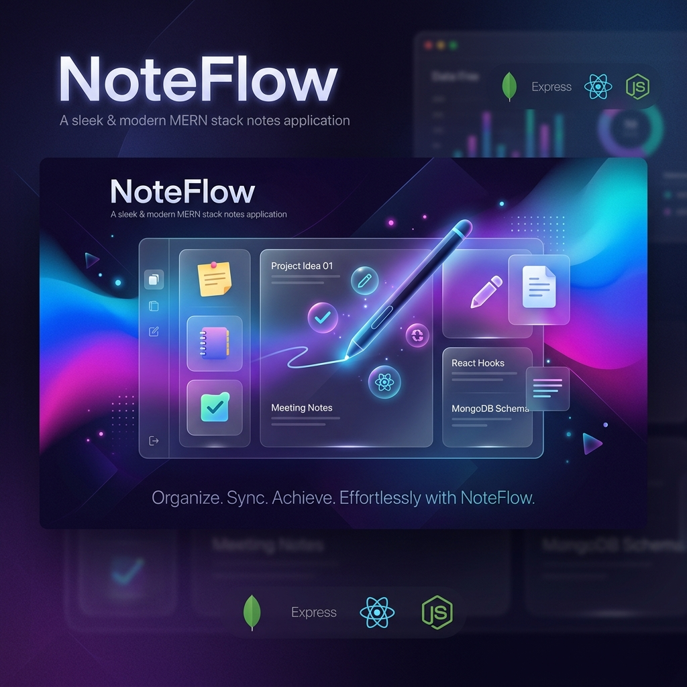

# 📝 NoteFlow - Scalable MERN Stack Note App



NoteFlow is a modern, high-performance, and scalable Full-Stack Note-Taking application built using the MERN (MongoDB, Express, React, Node.js) stack. It features a sleek UI with Tailwind CSS 4, seamless navigation with React Router 7, and a robust RESTful API.

---

## 🚀 Features

- **Full CRUD Operations**: Create, Read, Update, and Delete notes effortlessly.
- **Modern UI/UX**: Built with React 19 and Tailwind CSS 4 for a premium feel.
- **Dynamic Routing**: Fast and smooth page transitions using React Router 7.
- **Responsive Design**: Fully optimized for desktops, tablets, and mobile devices.
- **RESTful API**: A clean and scalable backend architecture.
- **Timestamps**: Automatically tracks when notes are created and updated.

---

## 🛠️ Tech Stack

### Frontend
- **React 19**: The latest version of the popular UI library.
- **Vite**: Ultra-fast build tool for modern web apps.
- **Tailwind CSS 4**: Next-gen utility-first CSS framework.
- **React Router 7**: Declarative routing for React.
- **Axios**: Promise-based HTTP client for API communication.

### Backend
- **Node.js**: JavaScript runtime environment.
- **Express 5**: Fast, unopinionated, minimalist web framework.
- **MongoDB & Mongoose**: NoSQL database for flexible data storage.
- **CORS**: Middleware to enable Cross-Origin Resource Sharing.
- **Dotenv**: Manage environment variables securely.

---

## 📂 Project Structure

```text
project3/
├── backend/                # Express & Node.js Server
│   ├── src/
│   │   ├── config/         # Database & App configurations
│   │   ├── controllers/    # Request handlers & logic
│   │   ├── model/          # Mongoose schemas & models
│   │   ├── routers/        # API route definitions
│   │   └── server.js       # Entry point
│   ├── package.json
│   └── .env                # Environment secrets
├── frontend/               # React & Vite Application
│   ├── src/
│   │   ├── components/     # Reusable UI components
│   │   ├── pages/          # Main application pages
│   │   ├── assets/         # Images & static files
│   │   ├── App.jsx         # Root component & routing
│   │   └── main.jsx        # App entry point
│   ├── package.json
│   └── vite.config.js
└── README.md
```

---

## ⚡ Getting Started

### Prerequisites
- Node.js installed
- MongoDB (Local or Atlas)
- NPM or Yarn

### 1. Clone the repository
```bash
git clone https://github.com/selamde/Scalable-mern-stack-note-app.git
cd project3
```

### 2. Backend Setup
```bash
cd backend
npm install
```
Create a `.env` file in the `backend` folder:
```env
PORT=5000
MONGODB_URI=your_mongodb_connection_string
```
Run the backend:
```bash
npm run dev
```

### 3. Frontend Setup
```bash
cd ../frontend
npm install
npm run dev
```
Open `http://localhost:5173` in your browser.

---

## 🔧 API Endpoints

| Method | Endpoint | Description |
| :--- | :--- | :--- |
| `GET` | `/api/notes` | Get all notes |
| `GET` | `/api/notes/:id` | Get a single note |
| `POST` | `/api/notes` | Create a new note |
| `PUT` | `/api/notes/:id` | Update an existing note |
| `DELETE` | `/api/notes/:id` | Delete a note |

---

## 🤝 Contributing

Contributions are welcome! Feel free to open an issue or submit a pull request.

1. Fork the Project
2. Create your Feature Branch (`git checkout -b feature/AmazingFeature`)
3. Commit your Changes (`git commit -m 'Add some AmazingFeature'`)
4. Push to the Branch (`git push origin feature/AmazingFeature`)
5. Open a Pull Request

---

## 📄 License

Distributed under the ISC License. See `LICENSE` for more information.

---

<p align="center">
  Built with ❤️ by <a href="https://github.com/selamde">Selamde</a>
</p>
